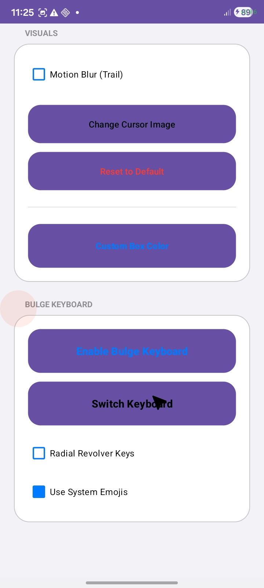
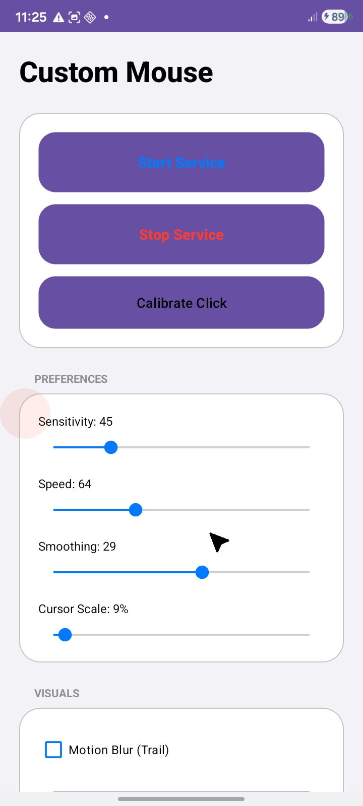
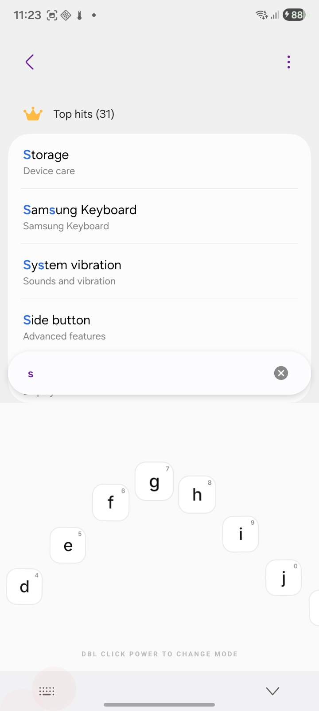
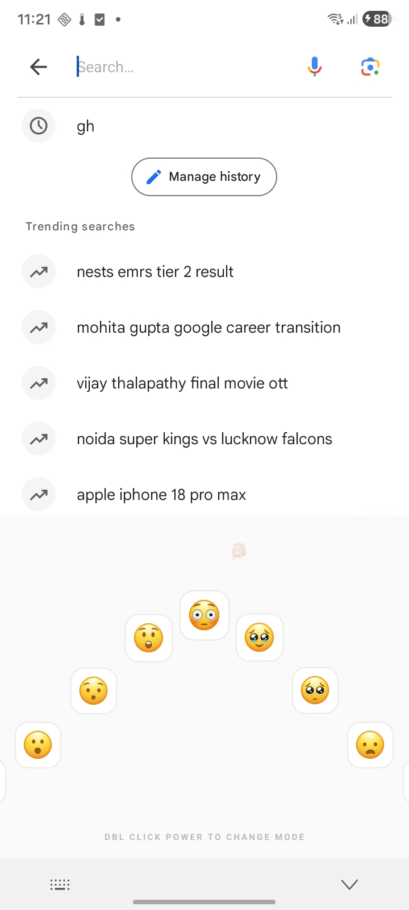

# Bulge Mouse & Keyboard

> An Android accessibility-focused controller that turns phone motion and hardware buttons into a screen-wide mouse pointer, while also providing a custom on-screen keyboard designed around the same interaction model.

**Status:** Functional development build — core mouse, accessibility, calibration, and keyboard functionality is implemented. The current development focus is **UI/UX refinement, visual polish, usability, and device-specific testing**.

---

## Overview

**Bulge Mouse & Keyboard** is an Android application built around an alternative input concept:

- Use the phone's motion sensors to control a mouse-style cursor.
- Display the cursor as a system-wide accessibility overlay.
- Use hardware buttons for clicking, double-clicking, scrolling, dragging, and keyboard actions.
- Calibrate the cursor so the visual pointer aligns correctly with the actual touch/gesture coordinate system.
- Replace the default cursor image with a custom image.
- Adjust sensitivity, speed, smoothing, cursor size, blur/ghosting, and cursor-zone color.
- Provide a custom Input Method Service (IME) for text entry.
- Support alphabetic, emoji, and symbol keyboard modes.
- Support lower-case, sentence-case, and upper-case text states.
- Provide an optional circular/revolver keyboard presentation.
- Support emoji categories and an optional system-emoji rendering mode.
- Provide haptic feedback for important interactions.
- Reduce sensor activity when the screen is off and detect proximity/pocket state.

The project is intentionally designed as a **native Android application**, using both Java and Kotlin.

---

---

## Screenshots

### Screenshot 1



### Screenshot 2



### Screenshot 3



### Screenshot 4



### Motion Blur Demo


## Main Features

### 1. Motion-Controlled Mouse

The application uses the Android sensor system to translate phone movement into cursor movement.

The service prefers:

1. `TYPE_GAME_ROTATION_VECTOR`
2. `TYPE_ACCELEROMETER` as a fallback

The raw movement is adjusted using sensitivity and speed values, transformed according to the device's current screen rotation, smoothed, and then applied to the cursor overlay.

The implementation also applies movement scaling to make larger movements useful without making small movements excessively difficult to control.

The motion-processing pipeline is implemented in `MyAccessibilityService`.

---

### 2. System-Wide Cursor Overlay

The mouse cursor is implemented as an accessibility overlay rather than a normal application view.

The overlay uses:

```text
TYPE_ACCESSIBILITY_OVERLAY
```

and is configured as a screen-wide, non-focusable, non-touchable overlay.

This allows the pointer to remain visible above other applications while the accessibility service is active.

The overlay also accounts for modern Android display cutout behavior.

---

### 3. Custom Cursor

Users can select an image to use as the cursor.

The selected image URI is stored in `SharedPreferences`, and the overlay reloads the image when required.

There is also a reset option that returns the cursor to the bundled default pointer asset.

---

### 4. Cursor Size

Cursor scale can be changed from the main settings screen.

The value is stored persistently and applied to:

- the active cursor
- cursor ghost images used by blur mode

---

### 5. Cursor Blur / Motion Ghosting

An optional blur-style visual effect creates several faded cursor "ghosts" behind the current position.

The overlay keeps a short movement history and places ghost cursors at previous positions.

This is useful for:

- making fast pointer movement easier to follow
- improving visual feedback
- giving the cursor a motion-trail appearance

---

### 6. Edge / Cursor Zones

The cursor has four logical edge zones:

```text
        TOP
         ↑
LEFT ← CURSOR → RIGHT
         ↓
       BOTTOM
```

The zones are used by the interaction system to trigger swipe/scroll actions.

The overlay calculates the cursor's real position using the calibration offsets before deciding whether the pointer is close enough to an edge.

---

### 7. Mouse Click

A normal hardware-button interaction produces a click at the calibrated cursor position.

### 7. Current Application Hardware Controls

In the current application:

- **Click:** Click is assigned to **D-pad Click**. You need to change the button mapping so that **Power** is assigned to D-pad Click, or change the click action from D-pad Click to Power.
- **Hold Power:** Holding the **Power** button performs a **drag**.
- **Double-click Power:** A **double-click** on the Power button performs a double-click action.
- **Open Notification:** Move the cursor to the **top-right corner** of the screen to open the notification area.
- **Swipe / Scroll:** Move the cursor toward the side in the direction you want to scroll/swipe. For example, to scroll downward, move the cursor to the **bottom side of the screen**. A bubble overlay will appear; place the cursor on the bubble and press **Volume Up**. The screen will scroll/swipe in the opposite direction, similar to how a normal swipe/scroll gesture works.


The click is dispatched using Android accessibility gestures.

The application also provides:

- click haptic feedback
- visual cursor feedback

---

### 8. Double Click

Two clicks in the click-processing window are converted into an accessibility double-click gesture.

This is implemented as two short gesture strokes separated by a small delay.

---

### 9. Sticky Drag

A long press on the primary mouse/select button toggles sticky-drag mode.

When enabled:

1. A gesture stroke begins at the current cursor position.
2. Cursor movement continues the gesture.
3. Another toggle ends the drag.

This allows drag operations without continuously holding a physical button.

---

### 10. Edge Scrolling / Swiping

When the cursor reaches one of the configured edge zones, the volume-up interaction can be used for scrolling/swiping behavior.

The implementation supports:

- top-zone swipe
- bottom-zone swipe
- left-zone swipe
- right-zone swipe
- continuous scrolling while scrolling mode is active

This makes hardware buttons part of the navigation system rather than only acting as ordinary volume controls.

---

## Calibration System

Different Android devices can expose slightly different coordinate relationships between:

- the visual overlay
- the physical display
- accessibility gesture coordinates
- system bars/cutouts

Bulge includes a dedicated calibration activity to compensate for this.

### Calibration flow

1. Open **Calibration**.
2. The app displays a centered crosshair.
3. The current cursor position is read from the overlay.
4. The difference between the crosshair center and cursor position is calculated.
5. The resulting X/Y offsets are saved.
6. Future click and drag operations use the calibrated offsets.

The offsets are stored as:

```text
clickX
clickY
```

in the application's `settings` preferences.

---

## Custom Cursor-Zone Color

The application includes a custom color picker based on a hue/saturation wheel.

The color picker:

- displays a circular HSV-style color wheel
- updates a preview
- applies transparency to the selected color
- saves the resulting color
- updates the active overlay immediately

The color is stored as:

```text
boxColor
```

---

# Bulge Keyboard

Bulge also contains a custom Android Input Method Service.

The keyboard is not simply a standard keyboard layout. It is designed around the same alternative-input concept as the mouse controller.

The keyboard is implemented using:

```text
BulgeKeyboardService
BulgeKeyboardView
KeyView
```

---

## Keyboard Modes

The keyboard currently defines three primary modes:

```text
ALPHA
EMOJIS
SYMBOLS
```

### Alpha Mode

The alphabetic mode contains:

- A–Z characters
- secondary characters
- switch controls
- case handling

Text case is represented internally as:

```text
LOWER
SENTENCE
UPPER
```

---

### Emoji Mode

Emoji mode is organized into categories.

Current categories include:

- Faces
- Hands
- Animals
- Food
- Nature
- Objects
- Hearts

The keyboard contains a large built-in emoji mapping and can use drawable resources or system emoji depending on the selected setting.

---

### Symbols Mode

Symbols are provided as another keyboard mode and are integrated into the same scrolling/focus interaction model.

---

## Revolver Mode

One of the distinctive keyboard features is **Revolver Mode**.

Instead of presenting keys as a conventional flat keyboard, keys are positioned along a circular/arc-like arrangement.

The implementation calculates each key's:

- translation
- angle
- scale
- opacity
- Z-index/elevation
- focus glow

The focused key becomes visually prominent while surrounding keys fade and rotate around the interaction area.

Revolver Mode also supports looping through the available keys so the selection can wrap around continuously.

---

## Keyboard Focus and Physics

Each key is represented by `KeyView`.

A key supports:

- normal click
- long press
- scale changes
- rotation
- opacity
- elevation
- focus glow
- pop animation
- selected/typed visual state
- cancelled state
- secondary character display

The keyboard uses a continuous animation loop to move the current keyboard position toward its target position.

This produces a smoother, physics-inspired selection experience.

---

## Hardware Button Keyboard Controls

The accessibility service coordinates hardware-button input with the keyboard service.

The current implementation includes behaviors such as:

| Hardware interaction | Keyboard behavior |
|---|---|
| Primary/select button | Type focused key |
| Long press primary/select | Type secondary character |
| Volume Up | Enter |
| Volume Up double-click | Keyboard-specific action / exit behavior |
| Volume Down | Backspace |
| Power/select-style long press | Keyboard secondary action depending on state |

The exact behavior depends on whether the keyboard is currently active.

---

# Main Application Controls

The main activity provides controls for:

### Mouse

- Start mouse
- Stop mouse
- Calibration
- Cursor image selection
- Reset cursor
- Cursor size
- Sensitivity
- Speed
- Smoothing
- Blur mode
- Custom cursor-zone color

### Keyboard

- Enable keyboard
- Switch keyboard
- Revolver Mode
- System Emoji rendering

Settings are persisted using Android `SharedPreferences`.

---

# Permissions

The application declares and/or relies on Android capabilities including:

```text
SYSTEM_ALERT_WINDOW
RECEIVE_BOOT_COMPLETED
WAKE_LOCK
VIBRATE
```

It also declares:

- an Android Accessibility Service
- an Android Input Method Service
- a boot receiver
- the calibration activity

The accessibility service is central to the application's mouse functionality.

The overlay requires the user to grant Android's overlay capability, and the application directs the user to Accessibility Settings when the accessibility service is not enabled.

---

# Architecture

High-level architecture:

```text
                    ┌──────────────────────┐
                    │     MainActivity     │
                    │ Settings / Controls  │
                    └──────────┬───────────┘
                               │
                               ▼
                    ┌──────────────────────┐
                    │  SharedPreferences   │
                    │ Persistent Settings  │
                    └──────────┬───────────┘
                               │
              ┌────────────────┴────────────────┐
              │                                 │
              ▼                                 ▼
┌──────────────────────────┐       ┌──────────────────────────┐
│ MyAccessibilityService   │       │ BulgeKeyboardService    │
│                          │       │                          │
│ Sensors                  │       │ Android IME              │
│ Hardware buttons         │       │ InputConnection          │
│ Accessibility gestures   │       │ Keyboard state           │
│ Click / drag / scroll    │       │                          │
└────────────┬─────────────┘       └────────────┬─────────────┘
             │                                  │
             ▼                                  ▼
┌──────────────────────────┐       ┌──────────────────────────┐
│ CursorOverlay            │       │ BulgeKeyboardView        │
│                          │       │                          │
│ Screen-wide cursor       │       │ Keyboard modes           │
│ Ghost trail              │       │ Revolver layout          │
│ Edge zones               │       │ Emoji categories         │
│ Cursor customization     │       │ Sensor-driven selection  │
└──────────────────────────┘       └────────────┬─────────────┘
                                                │
                                                ▼
                                      ┌──────────────────────┐
                                      │       KeyView        │
                                      │ Visual key component │
                                      └──────────────────────┘
```

---

# Project Components

## `MainActivity.java`

The main configuration and control screen.

Responsibilities include:

- reading and saving preferences
- starting/stopping the cursor overlay
- requesting overlay/accessibility settings
- launching calibration
- selecting cursor images
- resetting the cursor
- controlling mouse settings
- controlling keyboard settings
- opening the custom color picker

---

## `MyAccessibilityService.java`

The primary interaction engine.

Responsibilities include:

- sensor input
- cursor movement
- screen rotation handling
- smoothing
- sensitivity/speed processing
- proximity detection
- screen on/off handling
- click processing
- double-click processing
- sticky dragging
- edge scrolling
- hardware-button interpretation
- keyboard/mouse mode coordination
- haptic feedback
- automatic cursor hiding

---

## `CursorOverlay.java`

Responsible for the visual mouse pointer.

Responsibilities include:

- accessibility overlay creation
- cursor image
- cursor position
- cursor scaling
- ghost trail
- edge-zone indicators
- custom color
- hidden/visible state
- click feedback
- drag feedback
- display metric updates

---

## `CalibrationActivity.java`

Provides display/cursor calibration.

Responsibilities include:

- full-screen calibration UI
- center crosshair
- reading the cursor position
- calculating X/Y offsets
- storing calibration values

---

## `ColorWheelView.java`

Custom color-selection UI.

Responsibilities include:

- HSV color wheel rendering
- touch-based color selection
- selected-color tracking
- thumb positioning
- color callbacks

---

## `BulgeKeyboardService.kt`

Android IME service.

Responsibilities include:

- exposing the keyboard to Android
- creating `BulgeKeyboardView`
- committing typed characters
- handling Enter
- handling Backspace
- hiding the keyboard
- receiving hardware-button actions from the accessibility service

---

## `BulgeKeyboardView.kt`

Main keyboard UI and interaction engine.

Responsibilities include:

- keyboard modes
- text case
- emoji categories
- revolver mode
- key generation
- sensor-driven keyboard navigation
- smooth scrolling
- focused-key handling
- typing logic
- settings refresh

---

## `KeyView.kt`

Reusable visual key component.

Responsibilities include:

- rendering characters/emojis
- rendering secondary characters
- click/long-click handling
- focus effects
- animations
- scaling
- rotation
- opacity
- elevation
- visual feedback

---

## `NativeRunner.java`

Contains optional root/native integration.

The current implementation can:

- extract the bundled `vmouse` binary
- place it under `/data/local/tmp/vmouse`
- set executable permissions
- start/stop the process
- modify a navigation-bar setting on supported/rooted configurations

This component is **not the same as the standard accessibility mouse path** and should be treated as an optional/device-specific native integration.

---

## `SocketClient.java`

Provides a local Unix-domain socket client for:

```text
/data/local/tmp/vmouse.sock
```

It can send single-character commands to the native `vmouse` process.

---

## `BootReceiver.java`

The boot receiver is currently registered in the manifest but its implementation is intentionally disabled to avoid startup crashes.

Automatic boot initialization should therefore be considered unfinished/disabled behavior rather than a completed feature.

---

# Settings

The application currently persists several values in the `settings` preference file.

Examples include:

```text
sens
speed
smoothing
size
blur
revolver_mode
system_emojis
boxColor
cursorUri
clickX
clickY
```

This allows the application to retain user configuration between launches.

---

# Technology Stack

## Platform

- Android
- Android Accessibility Service
- Android Input Method Service
- Android Sensor APIs
- Android Gesture APIs
- Android WindowManager overlays

## Languages

- Java
- Kotlin

## UI

- Android Views
- `FrameLayout`
- `TextView`
- `ImageView`
- `SeekBar`
- `CheckBox`
- custom drawing
- custom animations

## Build

The supplied Gradle configuration currently specifies:

```text
compileSdk = 34
minSdk = 27
targetSdk = 34
Java = 17
Kotlin JVM target = 17
```

The project also enables Android View Binding.

Dependencies include AndroidX Core KTX, AppCompat, Material Components, Dynamic Animation, JUnit, AndroidX test extensions, and Espresso.

---

# Requirements

## Minimum Android Version

```text
Android 8.1 / API 27
```

## Target SDK

```text
API 34
```

## Recommended Device Capabilities

For the complete experience, a device should ideally provide:

- game rotation vector sensor
- accelerometer
- proximity sensor
- hardware buttons that can be intercepted by the accessibility service

The accelerometer provides a fallback when the preferred rotation-vector sensor is unavailable.

---

# Installation / Development

This repository is currently intended primarily for development and testing.

### 1. Clone the project

```bash
git clone https://github.com/Bujairkc/Gyro-vmouse
cd Gyro-vmouse
```

### 2. Open in Android Studio

Open the project using a recent Android Studio version capable of building:

- Android Gradle projects
- Kotlin/JVM 17
- compile SDK 34

### 3. Build

Use Android Studio's normal Gradle build/run flow.

Or:

```bash
./gradlew assembleDebug
```

### 4. Install on a test device

```bash
adb install -r app/build/outputs/apk/debug/app-debug.apk
```

> The exact APK output path can vary depending on the module configuration.

---

# First-Time Setup

After installing the application:

### Mouse setup

1. Open **Bulge Mouse & Keyboard**.
2. Enable the application's Accessibility Service.
3. Grant the required overlay permission.
4. Start the mouse overlay.
5. Open Calibration.
6. Align/calibrate the cursor.
7. Adjust sensitivity and speed.
8. Adjust smoothing if required.
9. Optionally select a custom cursor.
10. Optionally enable blur/ghosting.
11. Configure the cursor-zone color.

### Keyboard setup

1. Open the keyboard settings from the app.
2. Enable **Bulge Keyboard** in Android's Input Method settings.
3. Use Android's keyboard picker to switch to Bulge Keyboard.
4. Test alphabetic input.
5. Test emoji and symbol modes.
6. Enable Revolver Mode if desired.
7. Enable system emoji rendering if desired.

---

# Interaction Model

The application has two major states:

```text
MOUSE MODE
    ↓
Motion → Cursor
Hardware buttons → Click / Drag / Scroll

KEYBOARD MODE
    ↓
Motion / focus → Key selection
Hardware buttons → Type / Secondary / Enter / Backspace
```

When the keyboard is active, the accessibility service hides the mouse cursor and stops normal mouse motion processing so the two input systems do not compete for the same sensor input.

---

# Performance and Power Behavior

The application includes several mechanisms intended to reduce unnecessary work.

### Screen-off optimization

When the screen turns off, the service changes sensor registration behavior.

It uses lower-frequency sensor processing while maintaining the sensors needed for specific background behaviors.

When the screen turns on, the higher-rate rotation sensor processing is restored.

### Proximity detection

The proximity sensor is used to identify a pocket/near-object state.

When the device is considered pocketed, cursor motion processing is skipped.

### Cursor auto-hide

The cursor automatically becomes visually hidden after approximately 10 seconds without movement.

It becomes visible again when movement resumes.

---

# Accessibility Notes

This application makes significant use of Android accessibility functionality.

The Accessibility Service is required because the application needs to:

- display an accessibility overlay
- dispatch gestures to the screen
- interpret hardware key events
- coordinate mouse-style interaction across applications

Users should only enable the accessibility service if they understand and trust the application.

The project should clearly document any future release that changes the scope of accessibility data or event processing.

---

# Privacy

Based on the supplied application source:

- No cloud backend is defined in the reviewed Java/Kotlin code.
- No normal internet/network permission is declared in the supplied manifest.
- User preferences are stored locally with `SharedPreferences`.
- The selected cursor image is referenced through a persisted Android URI.
- The keyboard commits text through Android's `InputConnection`.

Because this application is an IME and Accessibility Service, future releases should be explicit about what input and accessibility events are processed and whether any external services are ever introduced.

---

# Current Development Status

## Core functionality

| Area | Status |
|---|---|
| Motion cursor | Implemented |
| Accessibility overlay | Implemented |
| Cursor customization | Implemented |
| Cursor size | Implemented |
| Blur/ghost cursor | Implemented |
| Calibration | Implemented |
| Sensitivity | Implemented |
| Speed | Implemented |
| Smoothing | Implemented |
| Click | Implemented |
| Double click | Implemented |
| Sticky drag | Implemented |
| Edge scrolling/swiping | Implemented |
| Haptic feedback | Implemented |
| Custom color picker | Implemented |
| Custom keyboard | Implemented |
| Alpha mode | Implemented |
| Emoji mode | Implemented |
| Symbol mode | Implemented |
| Text case states | Implemented |
| Emoji categories | Implemented |
| Revolver mode | Implemented |
| System emoji option | Implemented |
| Screen-off sensor optimization | Implemented |
| Proximity/pocket handling | Implemented |
| Native/root `vmouse` integration | Available as optional integration |
| Boot auto-start | Disabled / unfinished |

## Current focus

The core functionality is currently in place. The main development work is now focused on:

- UI refinement
- UX refinement
- visual consistency
- animations and transitions
- accessibility/usability improvements
- device compatibility
- calibration reliability across different Android devices
- edge-case testing
- documentation
- release packaging

---

# Known Limitations / Areas for Refinement

### Device-specific sensor behavior

Sensor values and physical movement characteristics vary between devices. Sensitivity and speed therefore require testing across multiple hardware configurations.

### Accessibility behavior

Android accessibility behavior can vary between Android versions and OEM implementations.

### Overlay behavior

System bars, display cutouts, navigation modes, and OEM modifications may affect the apparent cursor/gesture coordinate relationship.

Calibration exists specifically to compensate for these differences.

### Hardware buttons

The interaction model depends on hardware key events that may be handled differently by different manufacturers.

### Native `vmouse`

The `NativeRunner` path uses root (`su`) access and writes to `/data/local/tmp`. It should be treated as an optional experimental/device-specific integration rather than a requirement for the main accessibility-based mouse implementation.

### Boot receiver

The receiver is registered but currently does not perform startup work. Automatic startup should be implemented only after the lifecycle behavior is made reliable across supported devices.

---

# Suggested Repository Structure

A clean repository can be organized approximately as:

```text
.
├── app/
│   ├── src/
│   │   └── main/
│   │       ├── java/com/bulgekeyboard/
│   │       │   ├── MainActivity.java
│   │       │   ├── MyAccessibilityService.java
│   │       │   ├── CursorOverlay.java
│   │       │   ├── CalibrationActivity.java
│   │       │   ├── ColorWheelView.java
│   │       │   ├── NativeRunner.java
│   │       │   ├── SocketClient.java
│   │       │   └── BootReceiver.java
│   │       ├── kotlin/com/bulgekeyboard/
│   │       │   ├── BulgeKeyboardService.kt
│   │       │   ├── BulgeKeyboardView.kt
│   │       │   └── KeyView.kt
│   │       ├── res/
│   │       └── AndroidManifest.xml
│   └── build.gradle.kts
├── README.md
├── gradle/
├── build.gradle.kts
├── settings.gradle.kts
└── LICENSE
```

Adjust the exact structure to match the final repository layout.

---

# Development Roadmap

## Phase 1 — Core Functionality

- [x] Motion-based cursor
- [x] Accessibility overlay
- [x] Calibration
- [x] Click / double-click
- [x] Drag
- [x] Scroll/swipe
- [x] Custom cursor
- [x] Keyboard service
- [x] Emoji support
- [x] Revolver keyboard
- [x] Hardware-button integration

## Phase 2 — UI/UX Refinement

- [ ] Redesign settings screen
- [ ] Improve visual hierarchy
- [ ] Improve onboarding
- [ ] Add clearer permission/setup states
- [ ] Improve keyboard visual polish
- [ ] Improve calibration instructions
- [ ] Add live setting previews
- [ ] Improve error messages
- [ ] Improve animation consistency
- [ ] Add accessibility-friendly UI labels

## Phase 3 — Compatibility

- [ ] Test Android 8.1+
- [ ] Test Android 11+
- [ ] Test Android 13/14
- [ ] Test different navigation modes
- [ ] Test display cutouts
- [ ] Test multiple OEM implementations
- [ ] Test devices without rotation-vector sensors
- [ ] Test different hardware-button configurations

## Phase 4 — Release Preparation

- [ ] Finalize application branding
- [ ] Add screenshots
- [ ] Add demo video/GIF
- [ ] Finalize versioning
- [ ] Add release notes
- [ ] Add privacy documentation
- [ ] Add license
- [ ] Create signed release build
- [ ] Prepare GitHub release

---

# Contributing

Contributions are welcome once the project repository and contribution guidelines are finalized.

For development work, it is recommended to keep changes separated into areas such as:

```text
feat: new functionality
fix: bug fix
ui: UI/UX refinement
perf: performance improvement
refactor: code restructuring
docs: documentation
test: testing
```

Before submitting a pull request:

1. Build the project successfully.
2. Test the changed functionality on a physical Android device where possible.
3. Test both mouse and keyboard states if the change touches shared accessibility logic.
4. Check that persisted settings continue to work.
5. Document device-specific behavior when relevant.

---

# Debugging Checklist

If the cursor does not appear:

1. Check Accessibility Service is enabled.
2. Check overlay permission.
3. Start the mouse from the application.
4. Confirm the device has a supported motion sensor.
5. Try calibration.

If the cursor moves incorrectly:

1. Re-run calibration.
2. Adjust sensitivity.
3. Adjust speed.
4. Adjust smoothing.
5. Check device rotation/navigation configuration.

If the keyboard does not appear:

1. Enable Bulge Keyboard in Android Input Method settings.
2. Use the system keyboard picker.
3. Confirm the current text field accepts input.
4. Reopen the input method if necessary.

If keyboard hardware controls do not respond:

1. Confirm the accessibility service is enabled.
2. Confirm Bulge Keyboard is active.
3. Test the buttons outside the keyboard state.
4. Check OEM-specific key event behavior.

---

# Design Philosophy

Bulge is built around the idea that a smartphone can become a **remote-style universal input controller** rather than relying exclusively on conventional touch interaction.

The project combines:

```text
Motion sensing
      +
Accessibility gestures
      +
Hardware buttons
      +
Visual cursor feedback
      +
Custom keyboard
      =
Alternative Android input system
```

The goal is not only to reproduce a traditional mouse or keyboard, but to create an interaction model where movement, physical buttons, visual focus, and gesture automation work together.

---

# Project Maturity

This repository should currently be considered a **development / functional prototype** rather than a final production release.

The important distinction is:

> **The core functionality is implemented; the current priority is refinement.**

The next major step is therefore not rebuilding the core architecture, but improving:

- UI
- UX
- visual design
- onboarding
- reliability
- compatibility
- documentation
- release readiness

---

# License

No license is specified in the supplied project files.

Before publishing the repository publicly, choose and add an appropriate open-source license (or explicitly state that the project is proprietary).

---

# Credits / Project Information

**Project:** Bulge Mouse & Keyboard  
**Package:** `com.bulgekeyboard`  
**Platform:** Android  
**Minimum SDK:** 27  
**Target SDK:** 34  
**Compile SDK:** 34  
**Java:** 17  
**Kotlin JVM:** 17  

---

## Final Note

Bulge Mouse & Keyboard is currently a working development project with its core interaction systems implemented. The project is now at the stage where **UI/UX refinement, device testing, compatibility work, and release preparation** are the primary areas of development.
